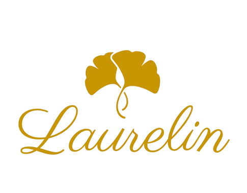

</a>

# SAE 301 : Développement d'une application

**Groupe_1_1 : Kyllian Arnaud, Jauzua Destain, Pol Lamothe, Brieuc Le Carluer, Thomas Souchet**

+ *Laurelin* est un site d'e-commerce de vente de bijoux de luxe.
+ L'adresse IP de la VM qui héberge le site est : [172.21.44.118](http://172.21.44.118/)

## Technologies choisies

+ Framework PHP : **[Laravel](https://laravel.com/)**
+ Framework JS : **[Vue.js](https://vuejs.org/)**
+ Base de données : **[MariaDB](https://mariadb.org/)**

Nous utilisons aussi **[Inertia](https://inertiajs.com/)** qui permet de faire le lien plus facilement entre Laravel et Vue en évitant d'avoir à développer une API.

## Organisation du projet

Nous avons suivi l'architecture MVC :

+ **Modèle** : les classes du modèle se trouvent dans le dossier `app/Domain`, elles sont réparties par fonctionnalitées (utilisateur, produit, etc). Dans chaque sous-dossier de `app/domain` on trouve trois dossiers `entities` qui contient les classes métier, `repositories` qui gère la persistance dans la base de données et `services` qui gère l'interaction avec les sessions et les cookies et met à disposition des fonctionnalités pour les contrôleurs. Les fichiers qui sont présents dans le dossier `app/Models` correspondent seulement aux classes de l'ORM Eloquent utilisé par Laravel.
+ **Vue** : du fait de l'utilisation d'un framework JS, les vues ne sont pas stockées dans `ressources/views` mais dans `ressources/js/Pages`. Dans ce dossier on retrouve les différentes pages du sites qui utilisent aussi certains composant présents dans le sous-dossier `Components`.
+ **Contrôleur** : ils sont présents dans le dossier `app/Http/Controllers`.

### Capture d'écran de la page d'accueil

